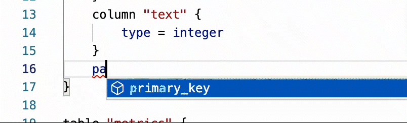

<p>&nbsp;</p>


# Atlas Monaco Editor
The library integrates Atlas HCL with Monaco Editor.
[Atlas HCL Demo](https://datdao.me/atlas-monaco)

## Features
### Code Completion

Library provides robust code completion support for all SQL resources available within Atlas. For a comprehensive list of the supported resources, please visit the following link: https://atlasgo.io/atlas-schema/sql-resources.


### SQL Dialect
Support for configuring dialects is available for specific database drivers, such as SQLite, MySQL, and PostgreSQL, etc.

### Referencing Qualified Tables
Users are able to search for attributes from multiple data blocks while working within a specific block. This feature can assist users in locating and referencing related data with greater ease.


### Linter
This feature allows for safer typing when defining a schema or configuring an Atlas project, as it uses a linter to check for errors while the user types. It will also warn the user if they type a word that does not follow the specified template.



## Installation

```bash
npm install atlas-monaco
```

## Usage

### Register AtlasHCL With React (@monaco-editor/react)

```ts
import * as AtlasHCL from "../../lib";
import Editor from "@monaco-editor/react";


function HCLSchemaEditor() {
    function handleEditorDidMount(editor, monaco) {
        AtlasHCL.AutoRegister(monaco)
        AtlasHCL.ConnectReactEditor(editor, monaco)
    }

    return (
        <div>
            <Editor
                onMount={handleEditorDidMount}
                options={{
                    wordBasedSuggestions: false
                }}
            />
        </div>

    );
  }
  
  export default HCLSchemaEditor;

```

After the ReactEditor has been rendered, we can use `AtlasHCL.ConnectReactEditor()` to connect it with AtlasHCL. [Full Example](./src/demo/editor/schema.tsx)

### Change SQL Dialect

```ts

import * as AtlasHCL from "../../lib";

// Select options with value are languague IDs provide by AtlasHCL
const languages = [
    {value: AtlasHCL.langIds.schema.sqlite, label: "sqlite"},
    {value: AtlasHCL.langIds.schema.mysql, label: "mysql"},
    {value: AtlasHCL.langIds.schema.postgresql, label: "postgresql"}
];

```

## Contrib

### Custom SQL Resource 
The configuration file is located at data/sql.ts. Follow these steps to configure the SQL resources:

- Use an object with key-value pairs to define a resource.
- Use a string with Attribute + Value to define a simple completion item.
- Use an array with Attribute + Value to define a completion item that supports multiple options.
- Use ${0|1|2|3} to define the position of the pointer after rendering. You can set priority by numbering the options. 
Use ${?} to auto set position

Standard datatypes:
```ts
bool: ["true", "false"],
number: "${?}",
string: "\"${?}\"",
array: "[${?}]",
switch: ["on", "off"],
ref: "${?}",
```

Example for config
```ts

mysql: {
        schema: {
            charset: dataType.string,
        },

        table: {
            schema: dataType.string,
            primary_key: {
                type: [
                    "BTREE",
                    ...
                ],
                columns: dataType.array
            },
            index: {
                comment: dataType.string,
                type: dataType.index,
                columns: dataType.array,
                unique: dataType.bool,
                on: {
                    column: dataType.string,
                    desc: dataType.bool,
                    where: dataType.string,
                    ...

```

