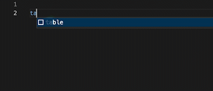
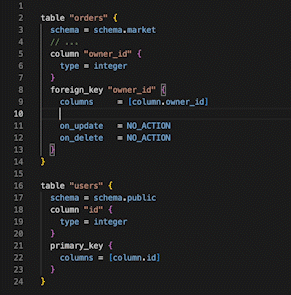

# Atlas Monaco Editor
The library integrates Atlas HCL with Monaco Editor.

## Features
### Code Completion

Library provides robust code completion support for all SQL resources available within Atlas. For a comprehensive list of the supported resources, please visit the following link: https://atlasgo.io/atlas-schema/sql-resources.




### SQL Dialect
Support for configuring dialects is available for specific database drivers, such as SQLite, MySQL, and PostgreSQL, etc.

### Referencing Qualified Tables
Users are able to search for attributes from multiple data blocks while working within a specific block. This feature can assist users in locating and referencing related data with greater ease.




## Installation

```bash
npm install atlas-monaco
```

## Usage

### Auto Register AtlasHcl

```ts
import { AutoRegisterToMonaco } from "../lib";
import { Dialect } from "../lib/dialect";

AutoRegisterToMonaco(Dialect.sql)

```

By using the AutoRegisterToMonaco() function, all configurations will be registered, including tokens, extensions, and completion providers.

### Manual Register AtlasHcl

```ts

const atlashcl = new AtlasHcl(dialect)
  
  // Register new language 
  monaco.languages.register({
    id: atlashcl.getLanguageName(),
    extensions: atlashcl.getLanguageExt()
  })

  // Set Tokenizer vs Language config
  monaco.languages.setLanguageConfiguration(
    atlashcl.getLanguageName(), 
    atlashcl.getLanguageConf())

  monaco.languages.setMonarchTokensProvider(
    atlashcl.getLanguageName(), 
    atlashcl.getTokenProvider()
  )

  // Register completion logic
  monaco.languages.registerCompletionItemProvide(
    atlashcl.getLanguageName(),
    atlashcl.getCompletionProvider()
  )

```

### Change Sql Dialect

```ts

const { registerCompletionItemProvider } = AutoRegisterToMonaco(Dialect.sql)

```

After using the provided function from the library, it will provide the ability to safely dispose and register again.

## Contrib

### Custom SQL Resource 
The configuration file is located at data/sql.ts. Follow these steps to configure the SQL resources:

- Use an object with key-value pairs to define a resource.
- Use a string with Attribute + Value to define a simple completion item.
- Use an array with Attribute + Value to define a completion item that supports multiple options.
- Use ${0|1|2|3} to define the position of the pointer after rendering. You can set priority by numbering the options.

```ts

mysql: {
        schema: {
            charset: "",
            collate: "",
            comment: ""
        },

        table: {
            schema: "",
            charset: "",
            collate: "",
            comment: "",
            primary_key: {
                columns: "[${0}]"
            },
            index: {
                comment: "",
                type: [
                    "BTREE",
                    "HASH",
                    "FULLTEXT",
                    ...

```

### Project Structure

```
src
 ┣ demo
 ┃ ┣ index.css
 ┃ ┗ index.ts
 ┗ lib
 ┃ ┣ autocompletion
 ┃ ┃ ┣ hclparser.ts
 ┃ ┃ ┗ index.ts
 ┃ ┣ data
 ┃ ┃ ┗ sql.ts
 ┃ ┣ tests
 ┃ ┃ ┗ index.test.ts
 ┃ ┣ atlashcl.ts 
 ┃ ┣ config.ts
 ┃ ┣ dialect.ts
 ┃ ┣ index.ts
 ┃ ┗ monaco-hcl.d.ts
```

